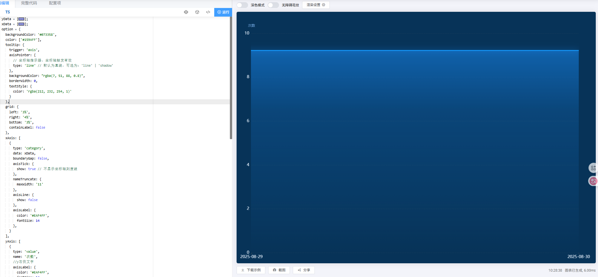

# 折线图案例

## 描述

> 可以在 Echarts 官网中能直接使用的数据案例

## 折线图-案例 1

```js
yData = [
  9.22, 9.22, 9.22, 9.22, 9.22, 9.22, 9.22, 9.22, 9.22, 9.22, 9.22, 9.22, 9.22,
  9.22, 9.22, 9.22, 9.22, 9.22, 9.22, 9.22, 9.22, 9.22, 9.22, 9.22, 9.22, 9.22,
  9.22, 9.22, 9.22, 9.22,
];
xData = [
  "2025-08-01","2025-08-02","2025-08-03","2025-08-04","2025-08-05","2025-08-06","2025-08-07","2025-08-08","2025-08-09","2025-08-10","2025-08-11","2025-08-12","2025-08-13","2025-08-14","2025-08-15","2025-08-16","2025-08-17","2025-08-18","2025-08-19","2025-08-20","2025-08-21","2025-08-22","2025-08-23","2025-08-24","2025-08-25","2025-08-26","2025-08-27","2025-08-28","2025-08-29","2025-08-30",
];
option = {
  backgroundColor: "#073358",
  color: ["#159AFF"],
  tooltip: {
    trigger: "axis",
    axisPointer: {
      // 坐标轴指示器，坐标轴触发有效
      type: "line", // 默认为直线，可选为：'line' | 'shadow'
    },
    backgroundColor: "rgba(7, 51, 88, 0.8)",
    borderWidth: 0,
    textStyle: {
      color: "rgba(212, 232, 254, 1)",
    },
  },
  grid: {
    left: "3%",
    right: "4%",
    bottom: "3%",
    containLabel: false,
  },
  xAxis: [
    {
      type: "category",
      data: xData,
      boundaryGap: false,
      axisTick: {
        show: true, // 不显示坐标轴刻度线
      },
      nameTruncate: {
        maxWidth: "11",
      },
      axisLine: {
        show: false,
      },
      axisLabel: {
        color: "#EAF4FF",
        fontSize: 14,
      },
    },
  ],
  yAxis: [
    {
      type: "value",
      name: "次数",
      //y右侧文字
      axisLabel: {
        color: "#EAF4FF",
        fontSize: 14,
      },
      nameGap: 20, // 坐标轴名称与轴线之间的距离。
      nameTextStyle: {
        color: "#6DA2DA",
      },
      // y轴的分割线
      splitLine: {
        show: true,
        lineStyle: {
          type: "dashed",
          color: "rgba(96, 98, 102, 0.2)",
        },
      },
    },
  ],
  series: [
    {
      name: "次数",
      type: "line",
      smooth: true,
      symbol: "none", // 不显示连接点
      lineStyle: {
        width: 3,
        shadowColor: "#1890FF",
        shadowBlur: 20,
      },
      areaStyle: {
        opacity: 1,
        //右下左上
        color: new echarts.graphic.LinearGradient(0, 0, 0, 1, [
          {
            offset: 0,
            color: "rgba(24, 144, 255, .5)",
          },
          {
            offset: 0.3,
            color: "rgba(24, 144, 255, 0.2)",
          },
          {
            offset: 1,
            color: "rgba(24, 144, 255, 0)",
          },
        ]),
      },
      data: yData,
    },
  ],
  dataZoom: [
    {
      type: "inside", //设置缩放方式为鼠标滚轮
      xAxisIndex: [0, 1], //设置dataZoom-inside组件控制的轴
      filterMode: "none", //不过滤数据，只改变数轴范围
    },
  ],
};
```


