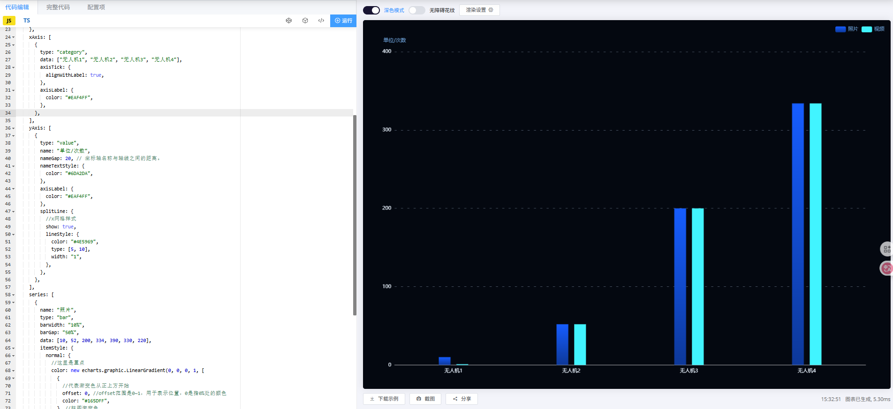
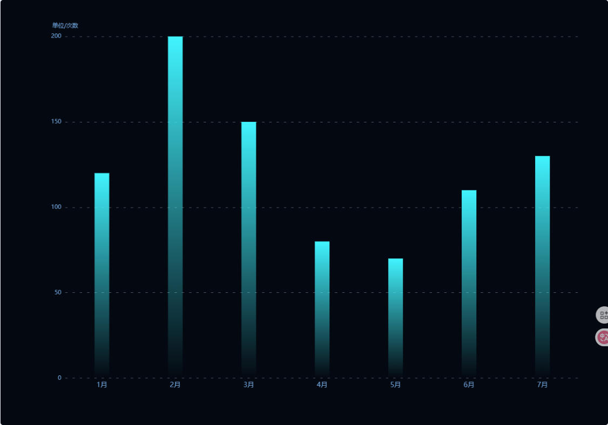

# 柱状图
## 柱状图-案例 1
### 效果图


### 代码
```js
option = {
    tooltip: {
      trigger: "axis",
      backgroundColor: "rgba(7, 51, 88, 0.8)",
      textStyle: {
        color: "#fff",
        border: "none",
      },
    },
    legend: {
      data: ["照片", "视频"],
      top: 0,
      right: 0,
      textStyle: {
        color: "#6DA2DA",
      },
    },
    grid: {
      left: "3%",
      right: "4%",
      bottom: "3%",
      containLabel: true,
    },
    xAxis: [
      {
        type: "category",
        data: ["无人机1", "无人机2", "无人机3", "无人机4"],
        axisTick: {
          alignWithLabel: true,
        },
        axisLabel: {
          color: "#EAF4FF",
        },
      },
    ],
    yAxis: [
      {
        type: "value",
        name: "单位/次数",
        nameGap: 20, // 坐标轴名称与轴线之间的距离。
        nameTextStyle: {
          color: "#6DA2DA",
        },
        axisLabel: {
          color: "#EAF4FF",
        },
        splitLine: {
          //x网格样式
          show: true,
          lineStyle: {
            color: "#4E5969",
            type: [5, 10],
            width: "1",
          },
        },
      },
    ],
    series: [
      {
        name: "照片",
        type: "bar",
        barWidth: "10%",
        barGap: "50%",
        data: [10, 52, 200, 334, 390, 330, 220],
        itemStyle: {
          normal: {
            //这里是重点
            color: new echarts.graphic.LinearGradient(0, 0, 0, 1, [
              {
                //代表渐变色从正上方开始
                offset: 0, //offset范围是0~1，用于表示位置，0是指0%处的颜色
                color: "#165DFF",
              }, //柱图渐变色
              {
                offset: 1, //指100%处的颜色
                color: "#0D3899",
              },
            ]),
          },
        },
      },
      {
        name: "视频",
        type: "bar",
        barWidth: "10%",
        itemStyle: {
          normal: {
            //这里是重点
            color: "#41F4FF",
          },
        },
        data: [1, 52, 200, 334, 290, 330, 220],
      },
    ],
  }
```


## 柱状图-案例 2
### 效果图


### 代码
```js
option = {
  tooltip: {
    trigger: 'axis',
    axisPointer: {
      // 坐标轴指示器，坐标轴触发有效
      type: 'line' // 默认为直线，可选为：'line' | 'shadow'
    },
    backgroundColor: 'rgba(7, 51, 88, 0.8)',
    borderWidth: 0,
    textStyle: {
      color: 'rgba(212, 232, 254, 1)'
    }
  },
  xAxis: {
    type: 'category',
    data: ['1月', '2月', '3月', '4月', '5月', '6月', '7月'],
    axisTick: {
      show: false // 不显示坐标轴刻度线
    },
    axisLine: {
      show: false
    },
    axisLabel: {
      color: '#6DA2DA',
      fontSize: 14
    }
  },
  yAxis: {
    type: 'value',
    name: '单位/次数',
    nameTextStyle: {
      color: '#6DA2DA'
    },
    axisLabel: {
      color: '#6DA2DA'
    },
    splitLine: {
      //x网格样式
      show: true,
      lineStyle: {
        color: '#4E5969',
        type: [5, 10],
        width: '1'
      }
    }
  },
  series: [
    {
      data: [120, 200, 150, 80, 70, 110, 130],
      type: 'bar',
      barWidth: '20%',
      itemStyle: {
        color: new echarts.graphic.LinearGradient(0, 0, 0, 1, [
          {
            offset: 0,
            color: 'rgba(65, 244, 255, 1)'
          },
          {
            offset: 1,
            color: 'rgba(65, 244, 255, 0)'
          }
        ])
      }
    }
  ],
  grid: {
    left: '10%',
    right: '4%',
    bottom: '10%',
    containLabel: false
  }
};
```
