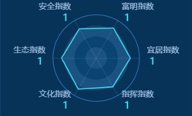

# 雷达图
## 雷达图-案例 1
### 效果图

### 代码
```js
const option =  {
    color: ['#67F9D8', '#FFE434', '#56A3F1', '#FF917C'],
    radar: {
        indicator: [
            { name: '安全指数', max: 100 },
            { name: '生态指数', max: 100 },
            { name: '文化指数', max: 100 },
            { name: '指挥指数', max: 100 },
            { name: '宜居指数', max: 100 },
            { name: '富明指数', max: 100 }
        ],
        startAngle: 120,
        splitNumber: 4,
        axisNameGap: 15,
        splitLine: {
            lineStyle: {
                // 使用深浅的间隔色
                color: ['rgba(81, 164, 255, 0.80)','transparent','transparent','transparent']
            }
        },
        splitArea: {
            areaStyle: {
                color: [
                    'rgba(174, 206, 241, 0.12)',
                    'transparent',
                    'rgba(174, 206, 241, 0.12)',
                    'transparent',
                ],
                shadowColor: 'rgba(0, 0, 0, 0.2)',
                shadowBlur: 10
            }
        },
        axisLine: {
            lineStyle: {
                color: 'rgba(174, 206, 241, 0.2)'
            }
        },
        shape: 'circle',
        axisName: {
            formatter: function (obj) {
                return '{a|' + obj + '}' + '\n' + '{b|' + 1 + '}';
            },
            rich: {
                a: {
                    fontSize: 16,
                    padding: 0,
                    color: 'rgba(174, 206, 241, 1)'
                },
                b: {
                    fontSize: 20,
                    padding: 5,
                    color: 'rgba(65, 244, 255, 1)'
                }
            },
            color: 'rgba(174, 206, 241, 1)'
        }
    },
    series: [
        {
            name: 'Budget vs spending',
            type: 'radar',
            itemStyle: {
                color: 'rgba(65, 244, 255, 1)'
            },
            areaStyle: {
                color: 'rgba(21, 154, 255, 0.23)'
            },
            data: [
                {
                    value: [78, 80, 83, 77, 79, 80],
                    symbol: 'none',
                    name: 'Allocated Budget'
                    // label: {
                    //   show: true,
                    //   formatter: function (params) {
                    //     return params.value;
                    //   }
                    // }
                }
            ]
        }
    ]
};
```