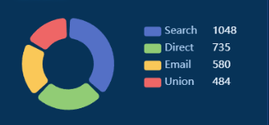
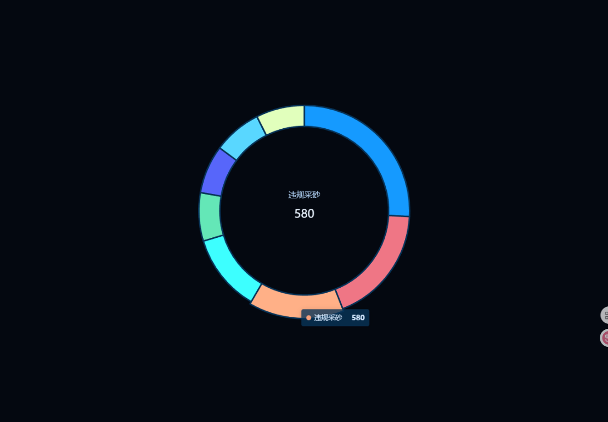
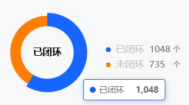

# 饼图
## 饼图-案例 1
### 效果图


### 代码
```js
dataValue = [
  { value: 1048, name: 'Search' },
  { value: 735, name: 'Direct' },
  { value: 580, name: 'Email' },
  { value: 484, name: 'Union' },
  { value: 300, name: 'Video' }
];

option = {
  backgroundColor: '#073358',
  tooltip: {
    trigger: 'item',
    backgroundColor: 'rgba(7, 51, 88, 0.8)',
    textStyle: {
      color: 'rgba(212, 232, 254, 1)'
    }
  },
  legend: {
    top: '40%',
    orient: 'vertical',
    right: 10,
    textStyle: {
      color: '#AECEF1',
      rich: {
        a: {
          fontSize: 15,
          width: 50
        },
        b: {
          fontSize: 15,
          width: 70,
          color: '#c1c1c1'
        }
      }
    },
    formatter: function (name) {
      // 添加
      let itemObject = dataValue.filter((item) => {
        return item.name === name;
      });
      var arr = ['{a|' + name + '}', '{b|' + itemObject[0].value + '}'];
      return arr.join('  ');
    }
  },
  series: [
    {
      // name: 'Access From',
      type: 'pie',
      radius: ['40%', '70%'],
      center: ['30%', '50%'],
      avoidLabelOverlap: false,
      padAngle: 5,
      itemStyle: {
        borderRadius: 10
      },
      label: {
        show: false,
        position: 'center'
      },
      emphasis: {
        label: {
          show: true,
          fontSize: 40,
          fontWeight: 'bold',
          color: '#FFF'
        }
      },
      labelLine: {
        show: false
      },
      data: dataValue
    }
  ]
};

```
### 饼图-案例 2
#### 效果图


#### 代码
```js
option = {
  tooltip: {
    trigger: 'item',
    backgroundColor: 'rgba(7, 51, 88, 0.8)',
    borderWidth: 0,
    textStyle: {
      color: 'rgba(212, 232, 254, 1)'
    }
  },
  color: [
    '#159aff',
    '#ef7685',
    '#f7a07b',
    '#3dffff',
    '#64e7b7',
    '#5766fa',
    '#59d7ff',
    '#e1ffbc'
  ],
  series: [
    {
      type: 'pie',
      radius: ['40%', '50%'],
      avoidLabelOverlap: false,
      label: {
        show: false,
        position: 'center',
        formatter: function (obj) {
          return '{a|' + obj.name + '}' + '\n' + '{b|' + obj.value + '}';
        },
        rich: {
          a: {
            fontSize: 16,
            color: '#AECEF1'
          },
          b: {
            fontSize: 23,
            padding: 20,
            color: '#EAF4FF'
          }
        }
      },
      emphasis: {
        label: {
          show: true,
          fontSize: 40,
          fontWeight: 'bold'
        }
      },
      labelLine: {
        show: false
      },
      itemStyle: {
        borderColor: '#073358',
        borderWidth: 3
      },
      data: [
        { value: 1048, name: '违规占用水域' },
        { value: 735, name: '违规建设' },
        { value: 580, name: '违规采砂' },
        { value: 484, name: '人、车、船识别' },
        { value: 300, name: '非法捕捞' },
        { value: 300, name: '违规垂钓' },
        { value: 300, name: '垃圾堆放' },
        { value: 300, name: '水面漂浮物' }
      ]
    }
  ]
};
```

## 饼图-案例 3
### 效果图


### 代码
```js
dataValue = [
  { value: 1048, name: '已闭环' },
  { value: 735, name: '未闭环' },
];
option = {
  tooltip: {
    trigger: 'item',
    // backgroundColor: 'rgba(7, 51, 88, 0.8)',
    // textStyle: {
    //   color: 'rgba(212, 232, 254, 1)'
    // }
  },
  legend: {
    top: '40%',
    orient: 'vertical',
    icon: 'circle',
    itemHeight: 8,
    itemWidth: 15,
    right: 10,
    textStyle: {
      color: '#606266',
      rich: {
        a: {
          fontSize: 16,
          width: 50,
          color: '#c1c1c1'
        },
        b: {
          fontSize: 15,
          width: 40,
          color: '#606266'
        }
      }
    },
    formatter: function (name) {
      // 添加
      let itemObject = dataValue.filter((item) => {
        return item.name === name;
      });
      var arr = ['{a|' + name + '}', '{b|' + itemObject[0].value + '}'+'个'];
      return arr.join('  ');
    }
  },
  series: [
    {
      // name: 'Access From',
      type: 'pie',
      radius: ['50%', '70%'],
      center: ['25%', '50%'],
      avoidLabelOverlap: false,
      color: ['#165DFF', '#FF7D00'],
      // padAngle: 5,
      itemStyle: {
        // borderRadius: 10
      },
      label: {
        show: false,
        position: 'center'
      },
      emphasis: {
        label: {
          show: true,
          fontSize: 16,
          fontWeight: 'bold',
          color: '#000'
        }
      },
      labelLine: {
        show: false
      },
      data: dataValue
    }
  ]
};
```